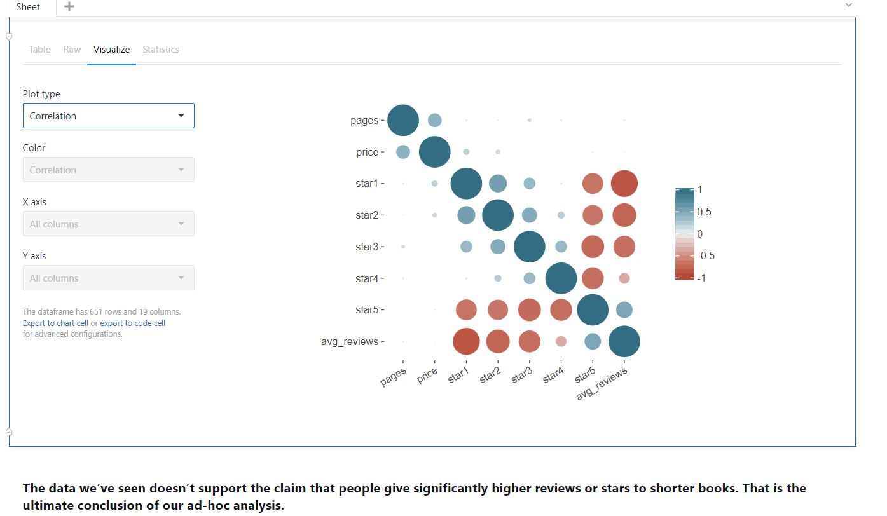

# Python-Amazon-Books
Using Datalore, I conducted Ad-Hoc Analysis on whether the length of Data Science books determined user ratings.

Ad Hoc Analysis on Amazon Data Science Books
What this Report addresses:
Basic descriptive statistics about the books.
Data cleaning
Main question: does the length of the book determine how successful it will be?

